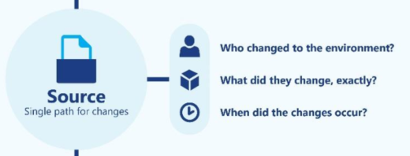
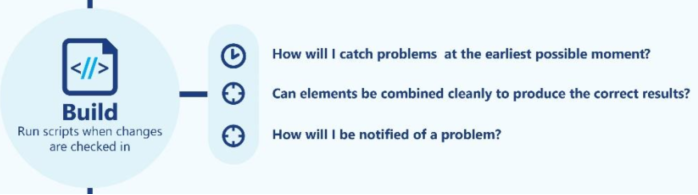
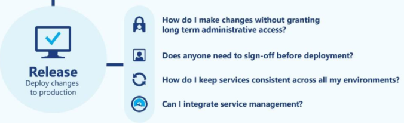

# PowerShell Ways of Working

---

### Where we were

- No task management system.
- Manually provisioning VMs would take at least 1hr.
- No source control.

---

### Where we were (Continued)

- No automated code analysis for best practices and formatting.
- No automated testing of code and/or environmenNo release automation.

---

### Where we want to be (1/4)

---

### Where we want to be (2/4)

---

### Where we want to be (3/4)

---

### Where we want to be (4/4)

---

### Where we are now

- Kanban workflow (Trello).
- Consistent VM templates using configuration-as-code (Packer).
- Automated, repeatable VM provisioning using configuration-as-code (Vagrant).

---

### Where we are now (Continued)

- Git source control with simple branching model.
- Automated analysis for best practices and formatting (PSScriptAnalyzer).
- Unit and Integration tests (Pester- Every task is now automated - provisioning, analysis, installing, testing, releasing (PSake).
